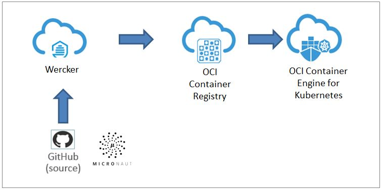
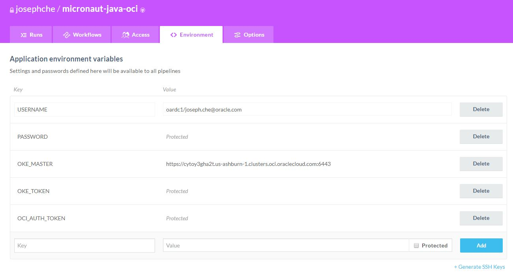
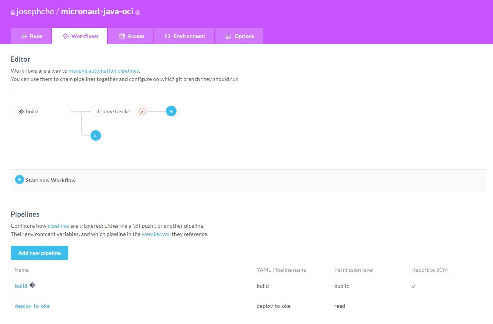

# Micronaut-Java-OCI

In this project, the tool allows developers to easily create a default Micronaut Java applications together with the supporting services and generates those files required for a basic CI/CD pipeline with ```Wercker``` and ```OKE```.



## Pre-requisites

##### Oracle Cloud Developer Image

This project assumes that you are using the [Oracle Cloud Developer Image](https://cloudmarketplace.oracle.com/marketplace/en_US/listing/54030984). If you are using the image, several tools have been installed and configured for you (e.g. Terraform, Git).

##### Required Services
1. [Wercker](https://app.wercker.com) (**user created**). You will need to manually create a free Wercker account and configure it following the instructions below.
2. [Github](https://github.com/) (**user created**). Your personal Github account is sufficient as long as you can fork this project.
3. [Oracle Container Engine for Kubernetes](https://docs.cloud.oracle.com/iaas/Content/ContEng/Concepts/contengoverview.htm). The tool can provision a cluster (OKE) for you if you require it, or you can also use your own existing Kubernetes cluster. You can enable the cluster provisioning following the instuctions below.

##### OCI-related requirements

1. [API Key](https://docs.cloud.oracle.com/iaas/Content/API/Concepts/apisigningkey.htm). The API key will be generated by the tool and you will need to upload it to your OCI user account.
2. [Auth Token](https://docs.cloud.oracle.com/iaas/Content/Registry/Tasks/registrygettingauthtoken.htm) (**user created**). This token value will be used for accessing the Container Registry. You will need to manually create this.

## Using the tool

### Clone the project

**Important**: Create a fork of this repo in your own personal Github account. The reason for forking the project is Wercker will have to connect to your Github account to link to the application later.

Clone the project in your Github account into your local environment.

```
$ git clone https://github.com/<your-id>/micronaut-java-oci.git
```

The scripts are non-executable at this point. You need to enable the executable permissions to them.

```
$ cd micronaut-java-oci
$ chmod -R +x bin/
```

### Create and upload the OCI API key

Run the script to generate the API keys.

```
$ bin/scripts/setup-api-key.sh
Generating RSA private key, 2048 bit long modulus
..................................................+++
.+++
e is 65537 (0x10001)
writing RSA key
writing RSA key
[INFO]  API key generated. Key fingerprint=(stdin)= b5:6c:ac:ff:4d:35:25:ee:5f:d7:29:73:9b:e2:cc:92
-----BEGIN PUBLIC KEY-----
MIIBIjANBgkqhkiG9w0BAQEFAAOCAQ8AMIIBCgKCAQEA2RbJ4Y0EW0S0t3yxOmin
mN9gHrkC9kvrNVdzkA6t9M+fKb6MJOF2p0vHs4kmoSAJIQxUUTLUuepNV7pLopjP
fx7Oau/YjW4EVjTknjWM4U2fvTJ5YHsVcYQZX5s2m1kKQPFKGP6uqx91cONxAY8B
ldTIA2m5nnq2O+ipSY+hBAsOBgnqUkFQnv3KTEUlSrSPwFUbo+omFVL6kjVuDXlZ
MIZvLXDcLO9pjDla+v7G/sFULrWTvRTXtLXfD/6zFbmQzXHq3bjwnLl4xfB9ijpB
PmpS8TpXeIy8E2WvG0FFmUy4C0NuWL7lnncwfVM5bZEGbL5UrajiHX641Iv2D4t3
tQIDAQAB
-----END PUBLIC KEY-----
[INFO]  Note: You are required to upload this key to your OCI user console. 
```

Take note of your fingerprint value ```b5:6c:ac:ff:4d:35:25:ee:5f:d7:29:73:9b:e2:cc:92```. Your fingerprint will be different as it is based off the dynamically generated keys. 

Now you will need to upload your public key. [https://docs.cloud.oracle.com/iaas/Content/API/Concepts/apisigningkey.htm](https://docs.cloud.oracle.com/iaas/Content/API/Concepts/apisigningkey.htm).

### Create the Auth Token

Create the Auth Token for your user. [https://docs.cloud.oracle.com/iaas/Content/Registry/Tasks/registrygettingauthtoken.htm](https://docs.cloud.oracle.com/iaas/Content/Registry/Tasks/registrygettingauthtoken.htm)

The Auth Token value will look something like ```fEfRHee}]Dwbn]2823:O```. This value will be your Container Registry password.

### Modify the vars file

Enter your application and OCI account values into the ```vars``` file. Refer to this for instructions on getting the values from OCI [https://docs.cloud.oracle.com/iaas/Content/API/Concepts/apisigningkey.htm](https://docs.cloud.oracle.com/iaas/Content/API/Concepts/apisigningkey.htm)

By default, the OKE provisioning is disabled. If you need a OKE cluster, change the ```PROVISION_BASIC_CLUSTER=true```.

file: ```micronaut-java-oci/vars```

```
#!/bin/sh

# Application
APPLICATION_NAME=hello-world

# OCI Registry
REGION_CODE=<region-code>     	# e.g. iad, phx
REGION_NAME=<region-name>       # e.g. us-ashburn-1, us-phoenix-1
TENANCY_NAME=<tenancy-name>

# OKE
NAMESPACE=default

# Provision OKE - only for provisioning OKE cluster
# If PROVISION_BASIC_CLUSTER is set to false, you are not required to enter the values below
PROVISION_BASIC_CLUSTER=true			# e.g. true, false
COMPARTMENT_OCID=<compartment-ocid>
TENANCY_OCID=<tenancy-ocid>
USER_OCID=<user-ocid>
USER_FINGERPRINT=<user-fingerprint>		# e.g. b5:6c:ac:ff:4d:35:25:ee:5f:d7:29:73:9b:e2:cc:92
```

### Let's go into overdrive! (mn-java-oci)

Now that you have configured it, executing the script ```mn-java-oci``` will create a Micronaut Java application structure and provision the OKE cluster for you if you define the ```PROVISION_BASIC_CLUSTER=true``` in the ```vars``` file.

Note: The process takes less than a minute (without OKE cluster provisioning) and about 10 minutes (with OKE provisioning) due to the Terraform OCI process running backend.

```
$ bin/mn-java-oci
mn-java-oci 0.0.1
[INFO]  PROVISION_BASIC_CLUSTER=true - Provisioning OKE cluster
./bin/scripts/setup-oke.sh: line 2: !/bin/bash: No such file or directory
**** Start of OKE Setup ****
**** Generating SSH Key ****
**** Cloning OCI-OKE Terraform ****

Initializing provider plugins...
- Checking for available provider plugins on https://releases.hashicorp.com...
- Downloading plugin for provider "local" (1.3.0)...

The following providers do not have any version constraints in configuration,
so the latest version was installed.

To prevent automatic upgrades to new major versions that may contain breaking
changes, it is recommended to add version = "..." constraints to the
corresponding provider blocks in configuration, with the constraint strings
suggested below.
...
...
...
```

After it is completed, you will now have the following application structure. 

* Java application files will be in ```micronaut-java-oci/hello-world/```.
* Kubeconfig file in ```micronaut-java-oci/bin/scripts/terraform/config```
* Wercker yaml is created in ```micronaut-java-oci/wercker.yml```
* Kubernetes yaml files are created in ```micronaut-java-oci/hello-world/oke/```

Note that you will find the ```OKE_MASTER``` and ```OKE_TOKEN``` values in the ```micronaut-java-oci/bin/scripts/terraform/config``` file generated.

### Setting up Wercker

Login to Wercker and select ```Add Application```. In the wizard, choose the ```micronaut-java-oci``` project from your Github account. 

Go into the application and create the following environment variables.

```
# You will need this four variables:
USERNAME	: <tenancy-name>/<username> e.g. oardc1/joseph.che@oracle.com
PASSWORD	: Your user Auth token value 
OKE_MASTER	: The address of the cluster (e.g. value is in config file)
OKE_TOKEN	: You can get the value from the kubeconfig file of your cluster (e.g. value is in config file)
```

Example screenshot:



The generated ```wercker.yml``` already includes the pipelines in the workflow to deploy application to OKE. The ```build``` workflow is enabled by default in Wercker, so now you need to add the ```deploy-to-oke``` pipeline and set it to execute after the ```build``` pipeline. An example screenshot below.



### Combining all of the above: Run the pipeline

You can commit and push your repo to Github now.

```
$ git commit -a -m "basic micronaut application created"
$ git push origin master
```

**Note**: The container image will be pushed into a private container repository on OCI under the same application name (e.g. hello-world). This is created by default, and the wercker step handle the creation of the Kubernetes secret on OKE if it is not exist.


## Conclusion

The pipeline will run automatically whenever code commit happens the next time. The generated ```wercker.yml``` and OKE yaml files are configured to do the following:
* Gradle compilation
* Dockerfile to containerize application
* Push container image to container registry in OCI (created in private mode)
* Deploy to OKE

#### Pending Work:

* OKE deployment to handle rolling upgrade strategy

