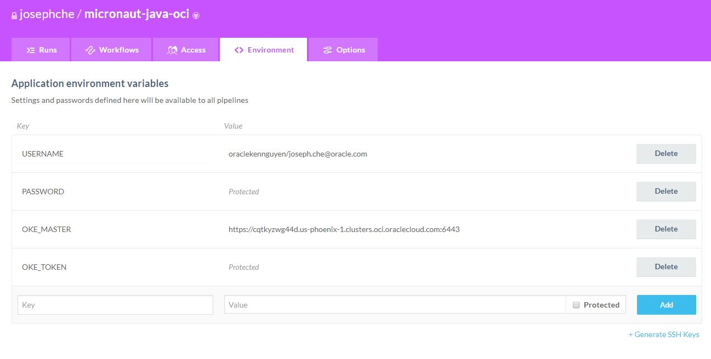

# Micronaut-Java-OCI

This project is created for developers to easily create default Micronaut Java applications and auto-generates the files required for basic CI/CD pipeline with ```Wercker``` and ```OKE```.

## Pre-requisites

1. [Wercker](https://app.wercker.com). A free account is sufficient to build your application.
2. [Oracle Container Engine for Kubernetes (OKE) ](https://cloud.oracle.com/containers/kubernetes-engine). You will need an active OKE cluster. This will be the cluster that the pipeline will deploy the application container.
3. [Github](https://github.com/). Your personal Github account is sufficient as long as you can fork this project.
4. [Micronaut](https://micronaut.io/). You need Micronaut installed on your local environment.

## Using the tool


### Configuration

**Important**: Create a fork of this repo in your own personal Github account. The reason for forking the project is Wercker will have to connect to your Github account to link to the application later.

Clone the project in your Github account into your local environment.

```
$ git clone https://github.com/<your-id>/micronaut-java-oci.git
```

Enter your application and OCI account values into the ```vars``` file

```
$ cd micronaut-java-oci
$ cat vars

#!/bin/sh

# Application
APPLICATION_NAME=hello-world

# OCI Registry
REGION_CODE=iad
TENANCY_NAME=mytenancy

# OKE
NAMESPACE=default
```

### Create the application.

```
$ cd micronaut-java-oci
$ ./bin/mn-java-oci
mn-java-oci 0.0.1
[INFO]  Creating Micronaut Java application
| Generating Java project...
| Application created at /home/vagrant/shared/git/micronaut-java-oci/hello-world
[INFO]  Generate Wercker files
[INFO]  Generate Kubernetes deployment files
[INFO]  Successfully created application
```
At this point, the basic application structure will be created. 

* Application files will be in ```micronaut-java-oci/hello-world/```
* Wercker yaml is created in ```micronaut-java-oci/wercker.yml```
* Kubernetes yaml files are created in ```micronaut-java-oci/hello-world/oke/```

You can commit and push your repo to Github now.

```
$ git commit -a -m "basic micronaut application created"
$ git push origin master
```

### Post Step 1: Link Wercker to your application

Login to Wercker and select ```Add Application```. In the wizard, choose the ```micronaut-java-oci``` project from your Github account. 

Go into the application and create the following environment variables.

```
# You will need this four variables:
USERNAME	: <tenancy-name>/<username> e.g. oardc1/joseph.che@oracle.com
PASSWORD	: Your user Auth token value 
OKE_MASTER	: The address of the cluster
OKE_TOKEN	: You can get the value from the kubeconfig file of your cluster
```

Example screenshot:



### Post Step 2: Enable deployment to OKE

The generated ```wercker.yml``` already includes the pipelines in the workflow to deploy application to OKE. The ```build``` workflow is enabled by default in Wercker, so now you need to add the ```deploy-to-oke``` pipeline and set it to execute after the ```build``` pipeline. An example screenshot below.


## Conclusion

The pipeline will run automatically whenever code commit happens the next time. The generated ```wercker.yml``` and OKE yaml files are configured to do the following:
* Gradle compilation
* Dockerfile to containerize application
* Push container image to container registry in OCI (*set to public*)
* Deploy to OKE

